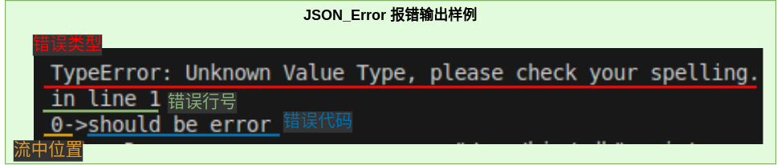

# 轻量级JSON解析器
## 背景
> JSON是一种轻量级数据交换格式， 被广泛应用于RESTful和各种RPC应用中。  
制作一个简易的JSON解析器便于对json类型的字串和文件做轻量便捷解析和处理

+ 基本功能
	- 实现使用递归下降解析器
    - 基于C++基本类型和STL容器，类型化JSON
		>object，array，int，bool，null和string
    - 解析std::istream为上述JSON类型
    - 将JSON类型序列化为std::ostream
    - 基于Google Test开发unittest
+ 扩展功能
    - 支持类似XML SAX的流式解析接口。
    - 支持UNICODE编码。
---
## 接口设计
>**所有MyJSON库中的函数以及类，都在namespace MyJSON**
### JSON_Value树
#### 解析接口&输出接口
>创建一个JSON_Value对象，通过其解析器返回解析出来的JSON树  
>>*返回一个智能指针*

	std::shared_ptr<MyJSON::JSON_Value> JSON_Value::parser(std::stringstream&);
	std::shared_ptr<MyJSON::JSON_Value> JSON_Value::parser(std::fstream&);
>
	using namespace MyJSON;
	//解析json
	JSON_Value Myparser
	std::shared_ptr<JSON_Value> JS = MyParser.parser(yourStream);
	//输出json
	JS->print(your ofstream);	// or std::cout

>*每个JSON_\* 对象都有相应的parser和print（JSON_Value除外，那个不能print）*  

	virtual std::ostream& JSON_Value::print(std::ostream& os);

#### 调用接口
>***MyJSON Type***  

	enum JSON_Type
	{
		JERROR = -1,
		JINITIAL,
		JOBJECT,
		JARRAY,
		JSTRING,
		JNUMBER,
		JBOOL,
		JNULL
	};
>**object**  

	std::shared_ptr<JSON_Object> Myobject = JS->get_obj();

	get_type() == JOBJECT;
	get_size()		//number of pairs in the Myobject

	Myobject[key]	//a shared_ptr<JSON_Value>, key's sample: "name"

	insert(key, value);

>**array**  

	std::shared_ptr<JSON_Array> Myarray = JS->get_arr();

	get_type() == Jarray;
	get_size()		//number of values in the Myarray;

	Myarray[index]	//a shared_ptr<JSON_Value>

	insert(index, value);		//index in range(0,size + 1)

>**string**  

	std::shared_ptr<JSON_String> Mystring = JS->get_str();

	get_type() == Jstring;
	get_value()		//the json style string in Mystring

	set_value(std::string);
	/*
		string in json is like "\"abcdefg\""
		string in other is like "abcdefg"
		so there is a sample below:
	*/
	Mystring->set_value("abc123!");
	Mystring->get_value() == "\"abc123!\""	//true

>**number**  

	std::shared_ptr<JSON_Number> Mynumber = JS-get_num();

	get_type() == Jnumber;
	/*for Get_value()
		return type is std::variant<int64_t, double, std::string>
		use auto to get the value
		if the value is out of range, return type is std::string*/
	get_value()
	get_value_string()		//return the value with string
	get_value_type()		//return the typename of value

	//	it will return false when the string is invalid for number
	set_value(std::string)

>**bool**  

	std::shared_ptr<JSON_Bool> Mybool = JS->get_boo();

	get_type() == Jbool;
	get_value()		//return true o false

	set_value(bool)

>**null**  

	std::shared_ptr<JSON_NULL> Mynull = JS->get_nul();

	get_type() == Jnull;
	//and you can do nothing

### SAJ (simple API for JSON)流式解析
> 这是一个类似XML的SAX流式解析器的解析接口  
> 允许用户自定义JSON数据的处理方式

#### 处理器
> 用户自定义的部分  
> *继承处理器基类 SAJ_Processor，然后重载里面的函数自定义解析*

	class SAJ_Processor
	{
	public:
		virtual void parse_start() = 0;	//开始解析
		virtual void parse_end() = 0;	//解析结束
		virtual void object_start() = 0;	//object开始（读到'{'）
		virtual void object_end() = 0;	//object结束（读到'}'）
		virtual void object_key(std::string) = 0;	//读到object类型中的键值（key）
		virtual void array_start() = 0;	//array开始（读到'['）
		virtual void array_end() = 0;	//array结束（读到']'）
		virtual void string(std::string) = 0;	//读取到字符串
		virtual void number_int(int64_t) = 0;	//读取到整型的数字
		virtual void number_double(double) = 0;	//读取到浮点型数字
		virtual void number_out_of_range(std::string) = 0;	//读取的数字范围超出整形或者浮点范围
		virtual void boolean(bool) = 0;	//读取到布尔类型（true或者false）
		virtual void null() = 0;	//读取到空类型（null）
		virtual void error(int error_line,	//读取中出现错误（error_line表示错误在文件第几行）
						   std::string last_token,	//（last_token是出错的位置或出错行内容）
						   std::string error_info) = 0;	//（error_info错误信息）
	};
> *~~处理器只需要重载函数就好了，而解析器复制树状解析代码需要考虑的就多了~~*
#### 解析器
> 与用户无关的部分  
> *自动解析一个JSON流，与JSON树的解析方式很相似，但是是调用用户重载的回调函数*

	class SAJ_Parser
	{
		static bool SAJ_value(std::stringstream&, SAJ_Processor&);
		static bool SAJ_object(std::stringstream&, SAJ_Processor&);
		static bool SAJ_array(std::stringstream&, SAJ_Processor&);
		static bool SAJ_string(std::stringstream&, SAJ_Processor&);
		static bool SAJ_number(std::stringstream&, SAJ_Processor&);
		static bool SAJ_bool(std::stringstream&, SAJ_Processor&);
		static bool SAJ_null(std::stringstream&, SAJ_Processor&);

		friend void parse_to_SAJ(std::stringstream&, SAJ_Processor&);
	};
#### 流式解析接口
> SAJ_Parser的友元函数

	void parse_to_SAJ(std::stringstream&, SAJ_Processor&);

## 错误信息
### JSON_Error
	std::ostream& JSON_Error::print(std::ostream& os)
	{
		os << error_type_ << "\nin line " << error_line << '\n';
		os << error_pos_ << "->" << error_code_ << '\n';
		return os;
	}
> *输出效果 (以std::cout为例)*  

### JSON_Value::get_xxx()
> 获取指针与指向对象不符时产生

	std::shared_ptr<JSON_Object> JSON_Value::get_obj()
	{
		if (type_ != JOBJECT) {
			std::cerr << "\niwanna JOBJECT, your type:"
					  << type_string(type_) << '\n';
			throw "type Error!";
		}
		return std::dynamic_pointer_cast<JSON_Object>(shared_from_this());
	}
	std::shared_ptr<JSON_Array> JSON_Value::get_arr()
	...
> *输出效果*  
**iwanna [JSON_Type], your type: [JSON_Type]** 
>
> 前面是当前函数期望获取的**类型**，后面是调用此函数的JSON_Value实际存放的**类型**

---
### 详情请移步:[《设计文档》](./设计文档.md)