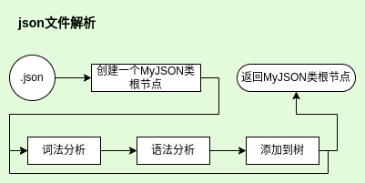
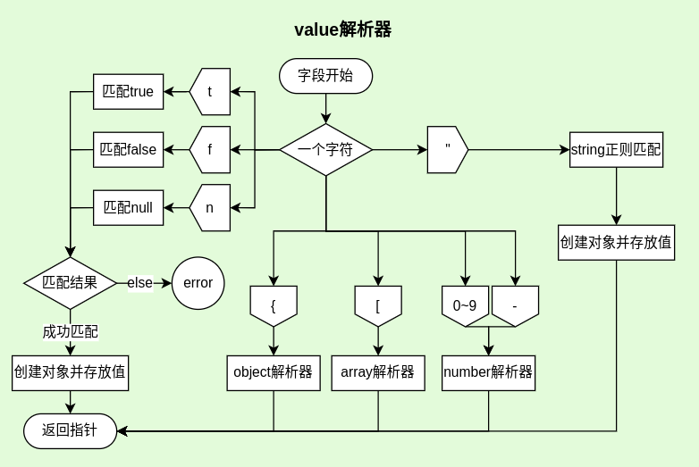

# JSON解析器软件设计文档

## 背景
> JSON是一种轻量级数据交换格式， 被广泛应用于RESTful和各种RPC应用中。  
制作一个简易的JSON解析器便于对json类型的字串和文件做轻量便捷解析和处理

+ 项目提出者：广州鼎甲计算机科技有限公司
+ 开发人员：陈锴瑞
+ 指导老师：娄永杰
+ 开发环境：
    - OS：Ubuntu20.04/22.04
    - 编辑器：VIM/VS code
    - 编译器：GCC(OS内置)
    - 构建：CMake
    - VCS：Git
+ 基本功能
	- 实现使用递归下降解析器
    - 基于C++基本类型和STL容器，类型化JSON
		>object，array，int，bool，null和string
    - 解析std::istream为上述JSON类型
    - 将JSON类型序列化为std::ostream
    - 基于Google Test开发unittest
+ 扩展功能(可选)
    - 支持类似XML SAX的流式解析接口。
    - 支持UNICODE编码。

### 参考资料
*JSON区*  
[JSON中国|JSON中文网](https://www.json.org.cn/)  
[RFC4627（JSON规范）](https://www.rfc-editor.org/rfc/rfc4627.txt)    
*参考区*  
[简易的 C++ JSON解析器](https://www.cnblogs.com/xqk0225/articles/18019385)  
[编译原理：递归下降分析](https://moyangsensei.github.io/2019/04/21/%E7%BC%96%E8%AF%91%E5%8E%9F%E7%90%86%EF%BC%9A%E9%80%92%E5%BD%92%E4%B8%8B%E9%99%8D%E5%88%86%E6%9E%90/)  
*文档区*  
[一个Json解析库的设计和实现](https://blog.csdn.net/zhaojia92/article/details/123969667)  
[书栈网《概要设计说明书》](https://www.bookstack.cn/read/DocumentTemplate/Architectural-Design-Specification.md)

---
## 设计思路
### 数据输入流程

### 数据结构
	class JSON_value	//基类

	class JSON_object: public JSON_value	//object类型数据
	class JSON_member: public JSON_value	//object下面的‘string:value’对
	class JSON_array: public JSON_value		//array类型数据
	class JSON_string: public JSON_value	//string类型数据
	class JSON_number: public JSON_value	//number类型数据
	class JSON_bool: public JSON_value		//true,false两个bool型
	class JSON_null: public JSON_value		//null类型
	class JSON_error: public JSON_value		//报错类型

---
## 实现方法
### 词法分析
#### json的数据类型
|	值名称	|	表达式	|	 描述	|
|----------|-------------|-----------|
| string	| ^"[^"]*" | 字符串， 两头包着"" |
| number	| ^-?([0]\|[1-9][0-9]\*)(.[0-9]{1,})?([e\|E][+\|-]?[1-9][0-9]*)? | 整形浮点 |
| bool		| (true)\|(false) | 就true和false |
| null		| (null)| 就null |
| object	| ^\\{(string:value)\*} | 由'{'和'}'包着的 若干个用','分隔的string:value对 |
| array		| ^\[(value)*] | 由'['和']'包着的 若干个用','分隔的value |

#### 词法分析流程图
***所有json的数据类型都是一种value***  

***数字通过正则表达式贪心匹配再转为值存储在对象中***  

***object解析器 & array解析器***  

### 语法分析
***使用递归下降解析器***  
***JSON文法***  
|   名称    |   符号    |   名称    |   符号    |
|----------|-----------|----------|----------|
|   object  |   O		|	member  |   M   |
|   array   |   A		|	string  |   s   |
|   value   |   V		|	number  |   n   |
| objectNode|   ON		|	bool    |   b   |
| arrayNode |   AN		|	null    |   u   |

	S -> S'
	S'-> O|A		//json文件从object或者array开始
	O -> {ON}
	A -> [AN]
	ON-> M,ON|M|ε	//multi one or void
	AN-> V,AN|V|ε	//same as above
	M -> s:V
	V -> O|A|s|n|b|u

#### json解析主流程

### 类和树形结构
	class JSON_value
	{
		JSON_value* left, *right, *child;	//左右兄弟和儿子
	public:
		JSON_value* get_left();
		...

		void set_left();
		...

        JSON_value():left(nullptr){}
		virtual ostream& print(ostream& os = std::cout) = 0;	//可以输出到终端或文件
	};

	class JSON_object: public JSON_value
	{

	};