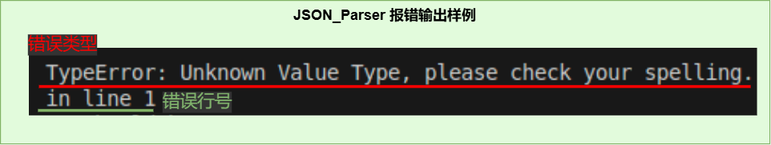

# 轻量级JSON解析器
## 背景
> JSON是一种轻量级数据交换格式， 被广泛应用于RESTful和各种RPC应用中。  
制作一个简易的JSON解析器便于对json类型的字串和文件做轻量便捷解析和处理

+ 基本功能
	- 实现使用递归下降解析器
    - 基于C++基本类型和STL容器，类型化JSON
		>object，array，int，bool，null和string
    - 解析std::istream为上述JSON类型
    - 将JSON类型序列化为std::ostream
    - 基于Google Test开发unittest
+ 扩展功能
    - 支持类似XML SAX的流式解析接口。
    - 支持UNICODE编码。
### 概述 
**此项目共有两个part**
1. **JSON_Value类**
	>存放JSON结构的数据类型，自带parser解析器和print输出器，支持流式解析接口
2. **SAJ(simple API for JSON)流式解析器**
	>JSON格式的流式解析器，继承处理器类并重载相应函数实现自定义解析
---
## 接口设计
>**所有MyJSON库中的函数以及类，都在namespace MyJSON**
### JSON_Value树
#### 解析接口&输出接口
>**JSON_Parser** 和 **JSON_Printer**  
>创建一个JSON_Value对象，通过其解析器返回解析出来的JSON树  
```cpp
using namespace MyJSON;
//解析json
istream is;
JSON_Parser MyParser
std::shared_ptr<JSON_Value> root;
root = MyParser.parse(is, root);
if(root == nullptr)
{
	// Error
	MyParser.print_error();//打印错误信息（默认cerr）
	/*或输出到错误日志等os流
		std::ofstream error_log;
		MyParser.print_error(error_log);
	*/
}

//输出json
ostream os;
JSON_Printer MyPrinter;
if(!MyPrinter.print(os, root))
{
	// Error
	MyPrinter.print_error();//同上
}
```
#### 调用接口
>***MyJSON Type***  
```cpp
enum JSON_Type
{
	JINITIAL,	//initial state means JSON_Value
	JOBJECT,
	JARRAY,
	JSTRING,
	JNUMBER,
	JBOOL,
	JNULL
};
```
>**object**  
```cpp
std::shared_ptr<JSON_Object> Myobject = JS->get_obj();

get_type() == JOBJECT;
get_size()		//number of pairs in the Myobject
get_child()		//return cites of the unordered_map

Myobject[key]	//return a shared_ptr<JSON_Value>, key's sample: "name"

insert(key, value);
```
>**array**  
```cpp
std::shared_ptr<JSON_Array> Myarray = JS->get_arr();

get_type() == Jarray;
get_size()		//number of values in the Myarray;
get_child()		//return cites of the vector

Myarray[index]	//return a shared_ptr<JSON_Value>

insert(index, value);		//index in range(0,size + 1)
```
>**string**  
```cpp
std::shared_ptr<JSON_String> Mystring = JS->get_str();

get_type() == Jstring;
get_value()		//return the json style string in Mystring

set_value(std::string);
/*
	string in json is like "\"abcdefg\""
	string in other is like "abcdefg"
	so there is a sample below:
*/
Mystring->set_value("abc123!");
Mystring->get_value() == "\"abc123!\""	//true
```
>**number**  
```cpp
std::shared_ptr<JSON_Number> Mynumber = JS-get_num();

get_type() == Jnumber;
/*for Get_value():
return type is std::variant<int64_t, double, std::string>
use auto or get<type>() to get the value
if the value is out of range, return type is std::string*/
get_value()
get_value_string()		//return the value with string
get_value_type()		//return the typename of value

//	it will return false when the string is invalid for number
set_value(std::string)
```
>**bool**  
```cpp
std::shared_ptr<JSON_Bool> Mybool = JS->get_boo();

get_type() == Jbool;
get_value()		//return true or false

set_value(bool)
```
>**null**  
```cpp
std::shared_ptr<JSON_NULL> Mynull = JS->get_nul();

get_type() == Jnull;
//and you can do nothing
```
### SAJ (simple API for JSON)流式解析
> 这是一个类似XML的SAX流式解析器的解析接口  
> 允许用户自定义JSON数据的处理方式

#### 处理器
> 用户自定义的部分  
> *继承处理器基类 SAJ_Processor，然后重载里面的函数自定义解析*  
> 设计文档中有样例->[《设计文档》](./doc/设计文档.md)
```cpp
class SAJ_Processor
{
public:
	virtual void parse_start() = 0;	//开始解析
	virtual void parse_end() = 0;	//解析结束
	virtual void object_start() = 0;	//object开始（读到'{'）
	virtual void object_end() = 0;	//object结束（读到'}'）
	virtual void object_key(std::string) = 0;	//读到object类型中的键值（key）
	virtual void array_start() = 0;	//array开始（读到'['）
	virtual void array_end() = 0;	//array结束（读到']'）
	virtual void string(std::string) = 0;	//读取到字符串
	virtual void number_int(int64_t) = 0;	//读取到整型的数字
	virtual void number_double(double) = 0;	//读取到浮点型数字
	virtual void number_out_of_range(std::string) = 0;	//读取的数字范围超出整形或者浮点范围
	virtual void boolean(bool) = 0;	//读取到布尔类型（true或者false）
	virtual void null() = 0;	//读取到空类型（null）
	virtual void error(int error_line,	//读取中出现错误（error_line表示错误在文件第几行）
						std::string error_info) = 0;	//（error_info错误信息）
};
```
> *~~处理器只需要重载函数就好了，而解析器复制树状解析代码需要考虑的就多了~~*
#### 解析器
> 与用户无关的部分  
> *自动解析一个JSON流，调用用户重载的回调函数*
```cpp
class SAJ_Parser
{
	static bool SAJ_value(std::istream&, SAJ_Processor&);
	static bool SAJ_object(std::istream&, SAJ_Processor&);
	static bool SAJ_array(std::istream&, SAJ_Processor&);
	static bool SAJ_string(std::istream&, SAJ_Processor&);
	static bool SAJ_number(std::istream&, SAJ_Processor&);
	static bool SAJ_bool(std::istream&, SAJ_Processor&);
	static bool SAJ_null(std::istream&, SAJ_Processor&);

	friend void parse_to_SAJ(std::istream&, SAJ_Processor&);
};
```
#### 流式解析接口
> SAJ_Parser的友元函数
```cpp
void parse_to_SAJ(std::istream&, SAJ_Processor&);
```
## 解析状态（错误信息）
### Parse_State & Print_State
```cpp
class Parse_State
	{
		bool state_ = true;	// Error:false
		std::string error_code_;
		int error_line_ = 1;
	public:
		void ignore_blank(std::istream& is);	// 解析时跳过空白字符
		bool get_state();
		// Error
		void set_error(std::string ei);
		void print_error(std::ostream& os);
	};
void JSON_Parser::print_error(std::ostream& os = std::cerr);	// 打印错误信息

class Print_State
	{
		bool state_ = true;
		std::string error_info_;
		int tab_deep_ = 0;
	public:
		void tab(bool ob);	// 打印时计算缩进
		int tab_deep();
		bool get_state();
		// Error
		void set_error(std::string ei);
		void print_error(std::ostream& os);
	};
void JSON_Printer::print_error(std::ostream& os = std::cerr);	// 打印错误信息
```
> ***输出效果*** *, 以std::cout为例(后续可能会有调整)*  


### JSON_Value::get_xxx()
> 获取指针与指向对象不符时产生
```cpp
std::shared_ptr<JSON_Object> JSON_Value::get_obj()
{
	if (type_ != JOBJECT) {
		std::cerr << "\niwanna JOBJECT, your type:"
					<< type_string(type_) << '\n';
		throw "type Error!";
	}
	return std::dynamic_pointer_cast<JSON_Object>(shared_from_this());
}
std::shared_ptr<JSON_Array> JSON_Value::get_arr()
...
```
```bash
iwanna [JSON_Type], your type: [JSON_Type]
```
> 前面是当前函数期望获取的***类型***，后面是调用此函数的JSON_Value实际存放的***类型***

---
### 详情请移步:[《设计文档》](./doc/设计文档.md)