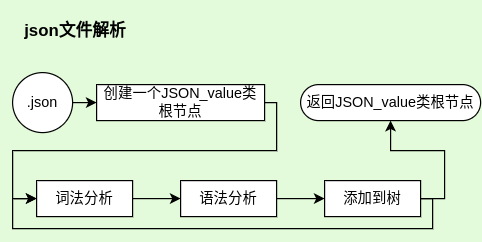
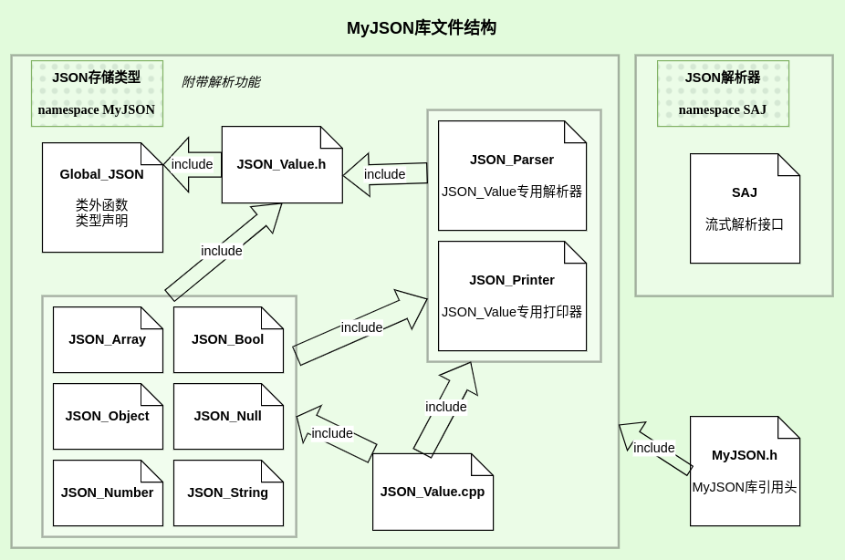
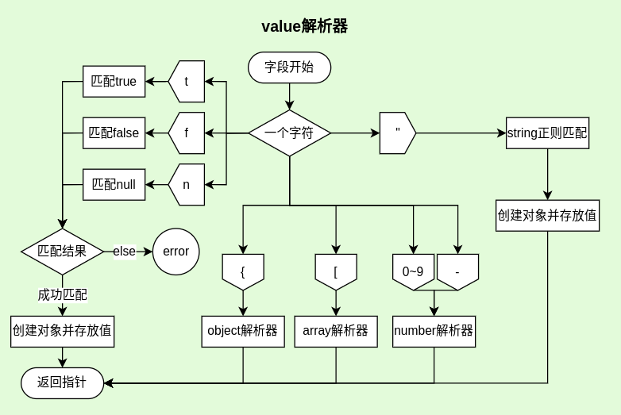
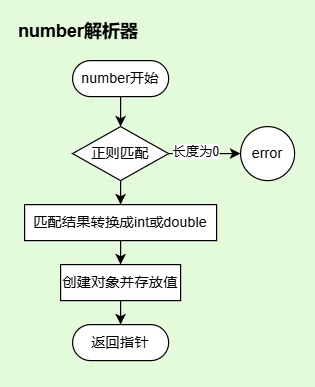
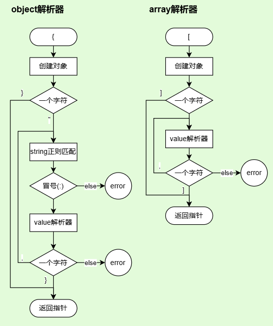
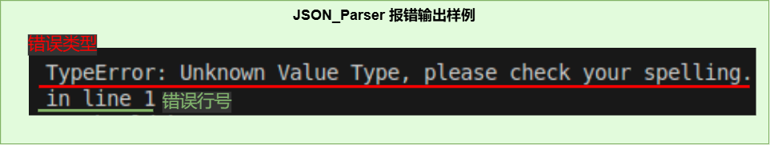

# JSON解析器软件设计文档

## 背景
> JSON是一种轻量级数据交换格式， 被广泛应用于RESTful和各种RPC应用中。  
制作一个简易的JSON解析器便于对json类型的字串和文件做轻量便捷解析和处理

+ 项目提出者：广州鼎甲计算机科技有限公司
+ 开发人员：陈锴瑞
+ 指导老师：娄永杰
+ 开发环境：
    - OS：Ubuntu20.04/22.04
    - 编辑器：VIM/VS code
    - 编译器：GCC(OS内置)
    - 构建：CMake
    - VCS：Git
+ 基本功能
	- 实现使用递归下降解析器
    - 基于C++基本类型和STL容器，类型化JSON
		>object，array，int，double，bool，null和string
    - 解析std::istream为上述JSON类型
    - 将JSON类型序列化为std::ostream
    - 基于Google Test开发unittest
+ 扩展功能(可选)
    - 支持类似XML SAX的流式解析接口。
    - 支持UNICODE编码。
### 应用场景
**此项目共有两个part**
1. **JSON_Value类**
	>存放JSON结构的数据类型，自带parser解析器和print输出器，支持流式解析接口
2. **SAJ(simple API for JSON)流式解析器**
	>JSON格式的流式解析器，继承处理器类并重载相应函数实现自定义解析
### 参考资料
*JSON区*  
[JSON中国|JSON中文网](https://www.json.org.cn/)  
[RFC4627（JSON规范）](https://www.rfc-editor.org/rfc/rfc4627.txt)    
*参考区*  
[简易的 C++ JSON解析器](https://www.cnblogs.com/xqk0225/articles/18019385)  
[编译原理：递归下降分析](https://moyangsensei.github.io/2019/04/21/%E7%BC%96%E8%AF%91%E5%8E%9F%E7%90%86%EF%BC%9A%E9%80%92%E5%BD%92%E4%B8%8B%E9%99%8D%E5%88%86%E6%9E%90/)  
*文档区*  
[一个Json解析库的设计和实现](https://blog.csdn.net/zhaojia92/article/details/123969667)  
[书栈网《概要设计说明书》](https://www.bookstack.cn/read/DocumentTemplate/Architectural-Design-Specification.md)

---
## 设计思路
### 数据输入流程


### 数据结构
```cpp
class JSON_Value						//基类

class JSON_Object: public JSON_Value	//object类型数据 通过std::unordered_map<JSON_Value>实现
class JSON_Array: public JSON_Value		//array类型数据 通过std::vector<JSON_Value>实现
class JSON_String: public JSON_Value	//string类型数据
class JSON_Number: public JSON_Value	//number类型数据
class JSON_Bool: public JSON_Value		//true,false两个bool型
class JSON_NULL: public JSON_Value		//null类型
```
### 文件管理

---
## 实现方法
### 词法分析
#### json的数据类型
|	值名称	|	表达式	|	 描述	|
|----------|-------------|-----------|
| string	| ^"[^"]*" | 字符串， 两头包着"" |
| number	| ^-?([0]\|[1-9][0-9]\*)(\\.[0-9]{1,})?([e\|E][+\|-]?[1-9][0-9]*)? | 整形浮点 |
| bool		| (true)\|(false) | 就true和false |
| null		| (null)| 就null |
| object	| ^\\{(string:value)\*} | 由'{'和'}'包着的 若干个用','分隔的string:value对 |
| array		| ^\[(value)*] | 由'['和']'包着的 若干个用','分隔的value |

#### 词法分析流程图
>***所有json的数据类型都是一种value***  


>***数字通过正则表达式贪心匹配再转为值存储在对象中***  


>***object解析器 & array解析器***  


### 语法分析
>***使用递归下降解析器***  
#### JSON文法
|   名称    |   符号    |   名称    |   符号    |
|----------|-----------|----------|----------|
|   object  |   O		|	member  |   M   |
|   array   |   A		|	string  |   s   |
|   value   |   V		|	number  |   n   |
| objectNode|   ON		|	bool    |   b   |
| arrayNode |   AN		|	null    |   u   |

	S -> S'
	S'-> O|A		//json文件从object或者array开始
	O -> {ON}
	A -> [AN]
	ON-> M,ON|M|ε		//object列表项可以是一个或多个或者空
	AN-> V,AN|V|ε		//array列表项同理
	M -> s:V
	V -> O|A|s|n|b|u
>其实json格式解析也可以看作一个大的object或者array词法分析

---
## 接口设计
>**所有MyJSON库中的函数以及类，都在namespace MyJSON**  
>**使用MyJSON库，可以直接 #include"MyJSON.h"**
### JSON_Value树
#### 解析接口&输出接口
>**JSON_Parser** 和 **JSON_Printer**  
>创建一个JSON_Value对象，通过解析器返回解析出来的JSON树  
```cpp
using namespace MyJSON;
//解析json
istream is;
JSON_Parser MyParser
std::shared_ptr<JSON_Value> root;
root = MyParser.parse(is, root);
if(root == nullptr)
{
	// Error
	MyParser.print_error();//打印错误信息（默认cerr）
	/*或输出到错误日志等os流
		std::ofstream error_log;
		MyParser.print_error(error_log);
	*/
}

//输出json
ostream os;
JSON_Printer MyPrinter;
if(!MyPrinter.print(os, root))
{
	// Error
	MyPrinter.print_error();//同上
}
```
#### 调用接口
>***MyJSON Type***  
```cpp
enum JSON_Type
{
	JINITIAL,	//initial state means JSON_Value
	JOBJECT,
	JARRAY,
	JSTRING,
	JNUMBER,
	JBOOL,
	JNULL
};
```
>**object**  
```cpp
std::shared_ptr<JSON_Object> Myobject = JS->get_obj();

get_type() == JOBJECT;
get_size()		//number of pairs in the Myobject
get_child()		//return cites of the unordered_map

Myobject[key]	//return a shared_ptr<JSON_Value>, key's sample: "name"

insert(key, value);
```
>**array**  
```cpp
std::shared_ptr<JSON_Array> Myarray = JS->get_arr();

get_type() == Jarray;
get_size()		//number of values in the Myarray;
get_child()		//return cites of the vector

Myarray[index]	//return a shared_ptr<JSON_Value>

insert(index, value);		//index in range(0,size + 1)
```
>**string**  
```cpp
std::shared_ptr<JSON_String> Mystring = JS->get_str();

get_type() == Jstring;
get_value()		//return the json style string in Mystring

set_value(std::string);
/*
	string in json is like "\"abcdefg\""
	string in other is like "abcdefg"
	so there is a sample below:
*/
Mystring->set_value("abc123!");
Mystring->get_value() == "\"abc123!\""	//true
```
>**number**  
```cpp
std::shared_ptr<JSON_Number> Mynumber = JS-get_num();

get_type() == Jnumber;
/*for Get_value():
return type is std::variant<int64_t, double, std::string>
use auto or get<type>() to get the value
if the value is out of range, return type is std::string*/
get_value()
get_value_string()		//return the value with string
get_value_type()		//return the typename of value

//	it will return false when the string is invalid for number
set_value(std::string)
```
>**bool**  
```cpp
std::shared_ptr<JSON_Bool> Mybool = JS->get_boo();

get_type() == Jbool;
get_value()		//return true or false

set_value(bool)
```
>**null**  
```cpp
std::shared_ptr<JSON_NULL> Mynull = JS->get_nul();

get_type() == Jnull;
//and you can do nothing
```
### SAJ (simple API for JSON)流式解析
> 这是一个类似XML的SAX流式解析器的解析接口  
> 允许用户自定义JSON数据的处理方式

#### 处理器
> 用户自定义的部分  
> *继承处理器基类 SAJ_Processor，然后重载里面的函数自定义解析*  
###### **如果想要使用SAJ让数据解析为树状，需要准备父指针跳出递归**
```cpp
class SAJ_Processor
{
public:
	virtual void parse_start() = 0;	//开始解析
	virtual void parse_end() = 0;	//解析结束
	virtual void object_start() = 0;	//object开始（读到'{'）
	virtual void object_end() = 0;	//object结束（读到'}'）
	virtual void object_key(std::string) = 0;	//读到object类型中的键值（key）
	virtual void array_start() = 0;	//array开始（读到'['）
	virtual void array_end() = 0;	//array结束（读到']'）
	virtual void string(std::string) = 0;	//读取到字符串
	virtual void number_int(int64_t) = 0;	//读取到整型的数字
	virtual void number_double(double) = 0;	//读取到浮点型数字
	virtual void number_out_of_range(std::string) = 0;	//读取的数字范围超出整形或者浮点范围
	virtual void boolean(bool) = 0;	//读取到布尔类型（true或者false）
	virtual void null() = 0;	//读取到空类型（null）
	virtual void error(int error_line,	//读取中出现错误（error_line表示错误在文件第几行）
						std::string error_info) = 0;	//（error_info错误信息）
};
```
> 处理器样例在文末[附录](#附录)  
> *~~处理器只需要重载函数就好了，而解析器复制树状解析代码需要考虑的就多了~~*
#### 解析器
> 与用户无关的部分  
> *自动解析一个JSON流，调用用户重载的回调函数*
```cpp
class SAJ_Parser
{
	static bool SAJ_value(std::istream&, SAJ_Processor&);
	static bool SAJ_object(std::istream&, SAJ_Processor&);
	static bool SAJ_array(std::istream&, SAJ_Processor&);
	static bool SAJ_string(std::istream&, SAJ_Processor&);
	static bool SAJ_number(std::istream&, SAJ_Processor&);
	static bool SAJ_bool(std::istream&, SAJ_Processor&);
	static bool SAJ_null(std::istream&, SAJ_Processor&);

	friend void parse_to_SAJ(std::istream&, SAJ_Processor&);
};
```
#### 流式解析接口
> SAJ_Parser的友元函数
```cpp
void parse_to_SAJ(std::istream&, SAJ_Processor&);
```
## 解析状态（错误信息）
### Parse_State & Print_State
```cpp
class Parse_State
	{
		bool state_ = true;	// Error:false
		std::string error_code_;
		int error_line_ = 1;
	public:
		void ignore_blank(std::istream& is);	// 解析时跳过空白字符
		bool get_state();
		// Error
		void set_error(std::string ei);
		void print_error(std::ostream& os);
	};
void JSON_Parser::print_error(std::ostream& os = std::cerr);	// 打印错误信息

class Print_State
	{
		bool state_ = true;
		std::string error_info_;
		int tab_deep_ = 0;
	public:
		void tab(bool ob);	// 打印时计算缩进
		int tab_deep();
		bool get_state();
		// Error
		void set_error(std::string ei);
		void print_error(std::ostream& os);
	};
void JSON_Printer::print_error(std::ostream& os = std::cerr);	// 打印错误信息
```
> ***输出效果*** *, 以std::cout为例(后续可能会有调整)*  


### JSON_Value::get_xxx() (throw Error)
> 获取指针与指向对象不符时产生
```cpp
std::shared_ptr<JSON_Object> JSON_Value::get_obj()
{
	if (type_ != JOBJECT) {
		std::cerr << "\niwanna JOBJECT, your type:"
					<< type_string(type_) << '\n';
		throw "type Error!";
	}
	return std::dynamic_pointer_cast<JSON_Object>(shared_from_this());
}
std::shared_ptr<JSON_Array> JSON_Value::get_arr()
...
```
> *输出效果*  
```bash
iwanna [JSON_Type], your type: [JSON_Type]
```
> 前面是当前函数期望获取的***类型***，后面是调用此函数的JSON_Value实际存放的***类型***

---
## 附录

#### 处理器样例 [SAJ_sample.cpp](../SAJ_sample.cpp)
```cpp
using namespace MyJSON;
using namespace SAJ;
class MyJSON_Processor:public SAJ_Processor
{
	std::shared_ptr<JSON_Value> root_;
	std::shared_ptr<JSON_Value> cur_;
	std::string key_;
	bool has_key_ = false;
	bool file_start_ = false;

	virtual void parse_start() override
	{
		file_start_ = true;
		std::cout << "parse start!\n";
	}
	virtual void parse_end() override
	{
		std::cout << "parse end\n";
	}
	virtual void object_start() override
	{
		std::cout << "object start\n";
		if (has_key_) {
			std::shared_ptr<JSON_Object> o = std::make_shared<JSON_Object>();
			o->set_father(cur_);
			cur_->get_obj()->insert(key_, o);
			cur_ = o;
			has_key_ = false;
		} else {
			//file start or in array
			if (file_start_) {
				root_ = std::make_shared<JSON_Object>();
				cur_ = root_;
				file_start_ = false;
			} else {
				std::shared_ptr<JSON_Object> o = std::make_shared<JSON_Object>();
				o->set_father(cur_);
				cur_->get_arr()->insert(cur_->get_arr()->get_size(), o);
				cur_ = o;
			}
		}
	}
	virtual void object_end() override
	{
		cur_ = cur_->get_father();
		std::cout << "object end\n";
	}
	virtual void object_key(std::string k) override
	{
		std::cout << "key: " << k << std::endl;
		key_ = k;
		has_key_ = true;
	}
	virtual void array_start() override
	{
		std::cout << "array start\n";
		if (has_key_) {
			std::shared_ptr<JSON_Array> a = std::make_shared<JSON_Array>();
			a->set_father(cur_);
			cur_->get_obj()->insert(key_, a);
			cur_ = a;
			has_key_ = false;
		} else {
			if (file_start_) {
				root_ = std::make_shared<JSON_Array>();
				cur_ = root_;
				file_start_ = false;
			} else {
				std::shared_ptr<JSON_Array> a = std::make_shared<JSON_Array>();
				a->set_father(cur_);
				cur_->get_arr()->insert(cur_->get_arr()->get_size(), a);
				cur_ = a;
			}
		}
	}
	virtual void array_end() override
	{
		cur_ = cur_->get_father();
		std::cout << "array end\n";
	}
	virtual void string(std::string str) override
	{
		std::cout << "string: " << str << '\n';
		if (has_key_) {
			std::shared_ptr<JSON_String> s = std::make_shared<JSON_String>();
			s->set_father(cur_);
			s->set_value(str);
			cur_->get_obj()->insert(key_, s);
			has_key_ = false;
		} else {
			if (file_start_) {
				root_ = std::make_shared<JSON_String>();
				cur_ = root_;
				cur_->get_str()->set_value(str);
				file_start_ = false;
			} else {
				std::shared_ptr<JSON_String> s = std::make_shared<JSON_String>();
				s->set_father(cur_);
				s->set_value(str);
				cur_->get_arr()->insert(cur_->get_arr()->get_size(), s);
			}
		}
	}
	virtual void number_int(int64_t i) override
	{
		std::cout << "number: " << i << '\n';
		if (has_key_) {
			std::shared_ptr<JSON_Number> n = std::make_shared<JSON_Number>();
			n->set_father(cur_);
			n->set_value(std::to_string(i));
			cur_->get_obj()->insert(key_, n);
			has_key_ = false;
		} else {
			if (file_start_) {
				root_ = std::make_shared<JSON_Number>();
				cur_ = root_;
				cur_->get_num()->set_value(std::to_string(i));
				file_start_ = false;
			} else {
				std::shared_ptr<JSON_Number> n = std::make_shared<JSON_Number>();
				n->set_father(cur_);
				n->set_value(std::to_string(i));
				cur_->get_arr()->insert(cur_->get_arr()->get_size(), n);
			}
		}
	}
	virtual void number_double(double d) override
	{
		std::cout << "number: " << d << '\n';
		if (has_key_) {
			std::shared_ptr<JSON_Number> n = std::make_shared<JSON_Number>();
			n->set_father(cur_);
			n->set_value(std::to_string(d));
			cur_->get_obj()->insert(key_, n);
			has_key_ = false;
		} else {
			if (file_start_) {
				root_ = std::make_shared<JSON_Number>();
				cur_ = root_;
				cur_->get_num()->set_value(std::to_string(d));
				file_start_ = false;
			} else {
				std::shared_ptr<JSON_Number> n = std::make_shared<JSON_Number>();
				n->set_father(cur_);
				n->set_value(std::to_string(d));
				cur_->get_arr()->insert(cur_->get_arr()->get_size(), n);
			}
		}
	}
	virtual void number_out_of_range(std::string str) override
	{
		std::cout << "number: " << str << '\n';
		if (has_key_) {
			std::shared_ptr<JSON_Number> n = std::make_shared<JSON_Number>();
			n->set_father(cur_);
			n->set_value(str);
			cur_->get_obj()->insert(key_, n);
			has_key_ = false;
		} else {
			if (file_start_) {
				root_ = std::make_shared<JSON_Number>();
				cur_ = root_;
				cur_->get_num()->set_value(str);
				file_start_ = false;
			} else {
				std::shared_ptr<JSON_Number> n = std::make_shared<JSON_Number>();
				n->set_father(cur_);
				n->set_value(str);
				cur_->get_arr()->insert(cur_->get_arr()->get_size(), n);
			}
		}
	}
	virtual void boolean(bool b) override
	{
		std::cout << b ? "true\n" : "false\n";
		if (has_key_) {
			std::shared_ptr<JSON_Bool> n = std::make_shared<JSON_Bool>();
			n->set_father(cur_);
			n->set_value(b);
			cur_->get_obj()->insert(key_, n);
			has_key_ = false;
		} else {
			if (file_start_) {
				root_ = std::make_shared<JSON_Bool>();
				cur_ = root_;
				cur_->get_boo()->set_value(b);
				file_start_ = false;
			} else {
				std::shared_ptr<JSON_Bool> n = std::make_shared<JSON_Bool>();
				n->set_father(cur_);
				n->set_value(b);
				cur_->get_arr()->insert(cur_->get_arr()->get_size(), n);
			}
		}
	}
	virtual void null() override
	{
		std::cout << "null\n";
		if (has_key_) {
			std::shared_ptr<JSON_NULL> n = std::make_shared<JSON_NULL>();
			n->set_father(cur_);
			cur_->get_obj()->insert(key_, n);
			has_key_ = false;
		} else {
			if (file_start_) {
				root_ = std::make_shared<JSON_NULL>();
				cur_ = root_;
				file_start_ = false;
			} else {
				std::shared_ptr<JSON_NULL> n = std::make_shared<JSON_NULL>();
				n->set_father(cur_);
				cur_->get_arr()->insert(cur_->get_arr()->get_size(), n);
			}
		}
	}
	virtual void error(int error_line,
			std::string last_token,
			std::string error_info) override
	{
		std::cerr << error_line << '\n';
		std::cerr << error_info << '\n';
		std::cerr << last_token << '\n';
	}

public:
	std::shared_ptr<JSON_Value> get_root()
	{
		return root_;
	}
};
```