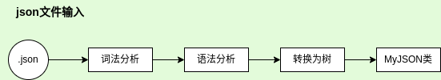

# JSON解析器软件设计文档

## 背景
> JSON是一种轻量级数据交换格式， 被广泛应用于RESTful和各种RPC应用中。  
制作一个简易的JSON解析器便于对json类型的字串和文件做轻量便捷解析和处理

+ 项目提出者：广州鼎甲计算机科技有限公司
+ 开发人员：陈锴瑞
+ 指导老师：娄永杰
+ 开发环境：
    - OS：Ubuntu20.04/22.04
    - 编辑器：VIM/VS code
    - 编译器：GCC(OS内置)
    - 构建：CMake
    - VCS：Git

### 参考资料
[“简易的 C++ JSON解析器”](https://www.cnblogs.com/xqk0225/articles/18019385)  
[《概要设计说明书》](https://www.bookstack.cn/read/DocumentTemplate/Architectural-Design-Specification.md)

---
## 设计思路
### 数据输入流程

## 实现方法
### 词法分析
**json的数据结构**
|	值名称	|	正则表达式	|	 描述	|
|----------|-------------|-----------|
| string	| [^\"]* | 字符串 |
| number 	| ^-?[1-9][0-9]* 或 ^-?([1-9][0-9]\*\\.[0-9]\*)|整形或者浮点型(科学计数法还没写)|
| bool		| (true)\|(false)|
| null		| (null)|
| object	||
| array		||